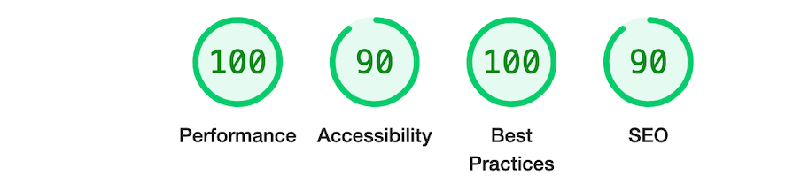

# Rock, Paper, Scissors, Lizard, Spock 

Welcome to Rock, Paper, Scissors, Lizard, Spock — an interactive web game built using HTML, CSS, and JavaScript. This game is a fun twist on the classic Rock, Paper, Scissors and is designed to be responsive, accessible, and easy to play.

---

##  Screenshots

*Showing game layout on different screens* 

*Landing screen with default scores*

*After a few rounds played*

---

##  Features

- Interactive game logic (play against the computer)
- Font Awesome icons for hand gestures (rock, paper, scissors, lizard and spock.)
- Displays player and computer choices in real time
- Score tracking for both player and computer
- Responsive layout for mobile and desktop screens
- Reset button to restart the game

---

## How to Play

1. Click on one of the five options.
2. The computer will randomly select its own move.
3. The game will determine the winner and update the scoreboard.
4. Press the "Reset Game" button to start over.

---

##  Testing

- HTML validated using [W3C Validator](https://validator.w3.org/)
- CSS validated using [Jigsaw Validator](https://jigsaw.w3.org/css-validator/)
- JavaScript tested using [JSHint](https://jshint.com/) with `esversion: 6`
- All buttons are keyboard accessible and visible for screen readers

---

##  Deployment

The site is deployed on **GitHub Pages**.  
[🔗 Click here to view the live site](https://sharon-bunyasi.github.io/Rock-Paper-Scissors-Lizard-Spock/)

To deploy:
1. Pushed the final version to GitHub repository
2. Enabled GitHub Pages via Settings → Pages → Branch: main /root
3. Verified the deployed site worked as expected

---

##  Technologies Used

- HTML5
- CSS3
- JavaScript (ES6)
- Font Awesome (via CDN)
- Git & GitHub for version control

---

## Performance & Accessibility (Lighthouse Report)

This project was tested using **Google Chrome's Lighthouse tool** to evaluate performance, accessibility, best practices, and SEO.

---

##  Acknowledgments

- Thanks to [Font Awesome](https://fontawesome.com) for the icon library
- Thanks to Youtube content videos
- Thanks to linkedin learning
- Thanks to my Code Institute mentors and classmates for feedback and support